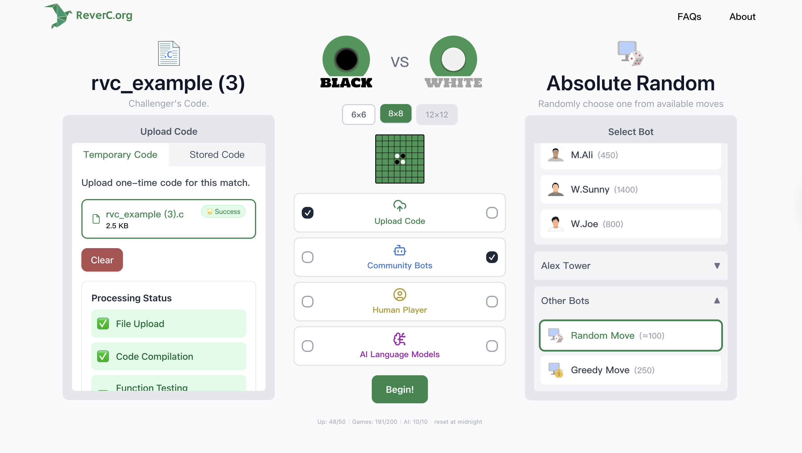
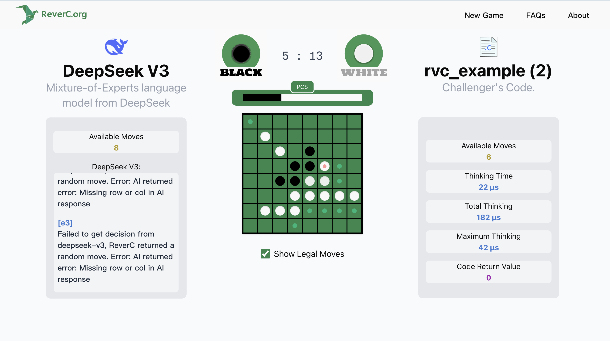
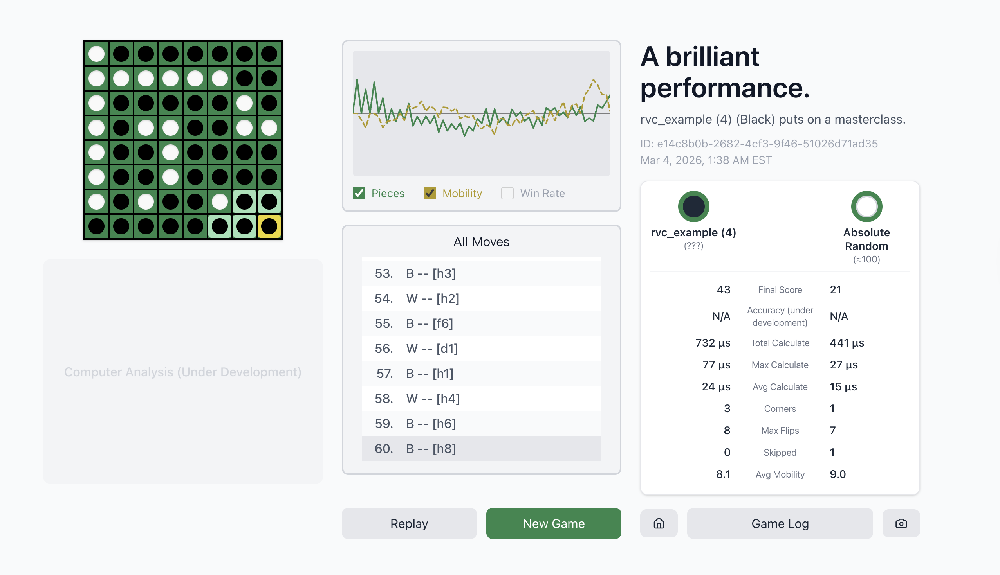

# 🎮 ReverC

**An interactive Reversi (Othello) platform for testing and visualizing C bot strategies.**

🌐 **Live Demo:** [www.reverc.org](https://www.reverc.org)

---

## About

ReverC is a browser-based platform where you can:
- **Battle AI Models** — Test your Reversi strategy against DeepSeek, Qwen, and Gemini AI
- **Challenge Community Bots** — Play against pre-built C bot implementations
- **Upload Your Own Code** — Submit your C `makeMove()` function and watch it compete in real-time
- **Visualize Matches** — See turn-by-turn board states with detailed game reports

Originally inspired by U of T APS105's Reversi lab assignment.

---

## Features

| Feature | Description |
|---------|-------------|
| 🤖 **AI Battle Mode** | Play against multiple LLM-powered AI opponents |
| 📦 **Community Bots** | Historical bot implementations to test against |
| 📤 **Code Upload** | Upload C code, auto-compiled in a secure sandbox |
| 📊 **Visual Reports** | Detailed match visualization and statistics |
| ⚡ **Real-time Gameplay** | Watch moves unfold with animated board updates |

---

## Tech Stack

| Layer | Technology |
|-------|------------|
| Frontend | Next.js 15, React 19, TypeScript, Tailwind CSS |
| Backend | FastAPI, Python 3.11, Uvicorn |
| C Compilation | GCC (dynamic `.so` generation) |
| AI Services | DeepSeek, Qwen, Gemini APIs |
| Deployment | Google Cloud Run |
| Storage | Google Cloud Storage |

---

## Screenshots

<!-- TODO: Add screenshots -->

*Homepage with game mode selection*

*Live game visualization*

*C code upload interface*

---

## Note

This project is deployed as a hosted service and does not support local development setup.  
Visit [reverc.org](https://reverc.org) to use the platform.

---

## Contact

**Developer:** Joe Wang  
**Email:** icedeverjoe@outlook.com  
**GitHub:** [@joewang0430](https://github.com/joewang0430)

---

## License

MIT License — See [LICENSE](LICENSE) for details.
